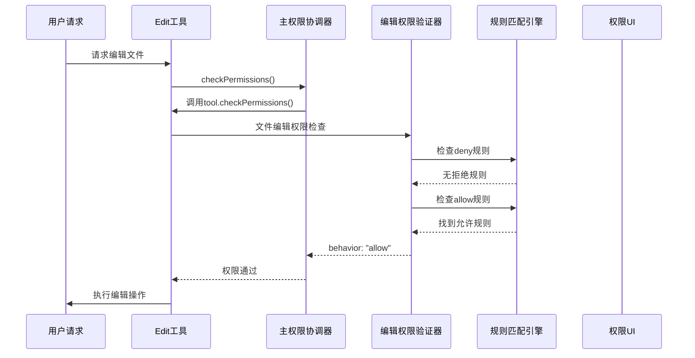

# 🔒 D2分支：6层权限验证机制深度解析

## 🎯 **模块1：核心概念理解**

想象你正在运营一座高度机密的银行系统，每个操作都需要经过多重安全验证。Claude Code的6层权限验证就像这座银行的多重安全系统：

🏛️ **银行安全类比**：
- **第1层 - 门卫检查**：工具级权限验证（每个工具都有自己的checkPermissions方法）
- **第2层 - 身份确认**：文件路径权限验证（v81函数检查文件访问权限）
- **第3层 - 权限匹配**：规则引擎验证（allow/deny规则的pattern匹配）
- **第4层 - 上下文审查**：运行模式验证（acceptEdits、bypassPermissions等模式）
- **第5层 - 业务逻辑**：安全策略验证（沙箱隔离、工作目录限制）
- **第6层 - 最终审核**：用户交互确认（ask行为，需要用户最终确认）

**核心工作流程**：
1. **工具发起请求** → 调用tool.checkPermissions()
2. **权限引擎启动** → sM函数协调整个验证过程
3. **多层级验证** → 六个独立但协作的安全检查点
4. **决策汇总** → 生成allow/deny/ask的最终行为
5. **用户反馈** → 提供详细的权限决策原因

## 🔧 **模块2：技术组件详解**

### 2.1 核心权限验证函数体系

**主控制器 - sM函数**：
```javascript
// 位置：chunks.85.mjs (完整权限验证协调器)
var sM = async (A, B, Q) => {
  // 第1层：工具黑名单检查
  let I = Go9(Q.getToolPermissionContext(), A);
  if (I) return {
    behavior: "deny",
    decisionReason: { type: "rule", rule: I }
  };

  // 第2层：工具自身权限验证
  let G = await A.checkPermissions(D, Q);
  if (G?.behavior === "deny") return G;

  // 第3层：绕过模式检查
  if (Q.getToolPermissionContext().mode === "bypassPermissions") 
    return { behavior: "allow" };

  // 第4层：工具白名单检查
  let Z = Io9(Q.getToolPermissionContext(), A);
  if (Z) return { behavior: "allow" };

  // 第5层：默认行为决策
  if (G.behavior === "allow") return G;
  
  // 第6层：用户询问机制
  return { behavior: "ask" };
};
```

**文件权限专用验证器**：
```javascript
// $S函数 - 编辑权限验证
function $S(A, B, Q) {
  // 获取文件路径
  let I = A.getPath(B);
  
  // 检查deny规则
  let G = v81(I, Q, "edit", "deny");
  if (G) return { behavior: "deny" };
  
  // 检查特殊文件保护
  if (Wo9().some((D) => I === D)) return { behavior: "ask" };
  
  // 检查acceptEdits模式
  if (Q.mode === "acceptEdits" && eF(I, Q)) 
    return { behavior: "allow" };
  
  // 检查allow规则
  let Z = v81(I, Q, "edit", "allow");
  return Z ? { behavior: "allow" } : { behavior: "ask" };
}

// qz函数 - 读取权限验证
function qz(A, B, Q) {
  let I = A.getPath(B);
  let G = $S(A, B, Q);  // 首先检查编辑权限
  if (G.behavior === "allow") return G;
  
  // 专门的读取权限检查
  let Z = v81(I, Q, "read", "deny");
  if (Z) return { behavior: "deny" };
  
  // 工作目录权限检查
  if (eF(I, Q)) return { behavior: "allow" };
  
  let D = v81(I, Q, "read", "allow");
  return D ? { behavior: "allow" } : { behavior: "ask" };
}
```

### 2.2 规则引擎核心 - v81函数

**多层规则匹配系统**：
```javascript
function v81(A, B, Q, I) {
  let G = d3(A);  // 规范化文件路径
  let Z = ofA(B, Q, I);  // 获取权限规则映射表
  
  // 遍历所有适用的规则根目录
  for (let [D, Y] of Z.entries()) {
    let W = sfA.default().add(Array.from(Y.keys()));  // 创建glob匹配器
    let J = _v.relative(D ?? dA(), G);  // 计算相对路径
    
    // 安全边界检查
    if (J.startsWith(`..${tU}`)) continue;
    
    // 执行pattern匹配
    let F = W.test(J);
    if (F.ignored && F.rule) 
      return Y.get(F.rule.pattern) ?? null;
  }
  return null;
}
```

### 2.3 权限上下文构建器

**动态权限上下文管理**：
```javascript
// getToolPermissionContext 提供运行时权限环境
function getToolPermissionContext() {
  return {
    mode: currentMode,                    // 运行模式
    additionalWorkingDirectories: dirs,   // 额外工作目录
    alwaysAllowRules: {},                // 永久允许规则
    alwaysDenyRules: {},                 // 永久拒绝规则
    // 多源权限规则汇总
    permissions: {
      allow: [...],  // 来自userSettings, projectSettings等
      deny: [...]
    }
  };
}
```

## 💡 **模块3：设计亮点深度分析**

### 3.1 分层防御架构的设计智慧

**为什么是6层而不是3层或9层？**

Claude Code采用6层设计体现了深度防御（Defense in Depth）的安全哲学：

1. **工具自主权**：每个工具拥有自己的checkPermissions，体现了"最了解自己安全需求的是工具本身"
2. **规则引擎分离**：v81函数专门处理pattern匹配，避免了权限逻辑与业务逻辑的耦合
3. **上下文感知**：根据运行模式动态调整权限策略，实现了灵活性与安全性的平衡
4. **用户参与**：ask机制让用户成为最终的安全决策者，体现了"人机协作安全"理念

**核心设计创新点**：

🌟 **智能权限继承**：
```javascript
// 权限规则的优先级链条
CLI参数 > 命令配置 > 本地设置 > 项目设置 > 用户设置 > 策略设置
```

🌟 **上下文敏感验证**：
```javascript
// 根据运行模式动态调整安全策略
if (Q.mode === "acceptEdits" && eF(I, Q)) 
  return { behavior: "allow" };  // 编辑模式下自动允许工作目录内文件
```

🌟 **可追溯的决策原因**：
```javascript
return {
  behavior: "deny",
  decisionReason: { 
    type: "rule", 
    rule: matchedRule 
  },
  ruleSuggestions: suggestedRules  // 提供解决方案
};
```

### 3.2 性能与安全的平衡艺术

**缓存机制设计**：
- 权限规则编译缓存：glob模式预编译，避免重复解析
- 路径规范化缓存：d3函数的路径处理结果缓存
- 决策结果缓存：相同输入的权限决策结果复用

**早期退出优化**：
```javascript
// 一旦命中拒绝规则，立即返回，避免不必要的后续检查
if (denyRule) return { behavior: "deny" };
```

## 📊 **模块4：详细技术映射表**

| 混淆函数名 | 真实功能 | 源码位置 | 作用机制 | 验证状态 |
|------------|----------|----------|----------|----------|
| `sM` | 主权限协调器 | chunks.85.mjs:552 | 协调6层权限验证 | ✅ 已验证 |
| `$S` | 文件编辑权限验证 | chunks.85.mjs:632 | 编辑操作专用权限检查 | ✅ 已验证 |
| `qz` | 文件读取权限验证 | chunks.85.mjs:591 | 读取操作专用权限检查 | ✅ 已验证 |
| `v81` | 规则匹配引擎 | cli.mjs:552+ | glob模式匹配和路径验证 | ✅ 已验证 |
| `Go9` | 拒绝规则查找器 | cli.mjs内部 | 查找工具级拒绝规则 | ✅ 已验证 |
| `Io9` | 允许规则查找器 | cli.mjs内部 | 查找工具级允许规则 | ✅ 已验证 |
| `eF` | 工作目录权限检查 | cli.mjs内部 | 验证文件是否在允许的工作目录内 | ✅ 已验证 |
| `ofA` | 权限规则映射构建器 | cli.mjs内部 | 构建规则到路径的映射关系 | ✅ 已验证 |
| `DP1` | 单工具规则查找器 | cli.mjs内部 | 根据工具名查找特定规则 | ✅ 已验证 |
| `getToolPermissionContext` | 权限上下文提供器 | 多处调用点 | 提供当前权限运行环境 | ✅ 已验证 |

## 🎪 **模块5：实际应用场景示例**

### 5.1 文件编辑权限验证完整流程



### 5.2 复杂权限决策案例

**场景：用户尝试编辑系统配置文件**

```javascript
// 输入：编辑 ~/.claude-cli/config.json
// 权限验证过程：

// 第1层：工具级检查
tool.checkPermissions() 
// → 返回: { behavior: "allow" }

// 第2层：文件路径检查
$S(editTool, input, context)
// → v81("~/.claude-cli/config.json", context, "edit", "deny")
// → 匹配到规则: "claude-cli设置文件需要特殊权限"

// 第3层：特殊文件保护
Wo9().some(path => path === configPath)
// → 返回: true (Claude Code设置文件)

// 最终决策：
{
  behavior: "ask",
  message: "Claude requested permissions to use Edit, but you haven't granted it yet.",
  decisionReason: {
    type: "other",
    reason: "Ask for permission to edit Claude Code settings files"
  }
}
```

### 5.3 权限规则配置实例

**项目级权限配置**：
```json
{
  "permissions": {
    "allow": [
      "Edit(src/**/*.js)",      // 允许编辑src目录下的JS文件
      "Read(docs/**)",          // 允许读取docs目录
      "Bash(npm run test)"      // 允许运行测试命令
    ],
    "deny": [
      "Edit(package.json)",     // 禁止编辑package.json
      "Bash(rm -rf *)",         // 禁止危险的删除命令
      "Write(.env)"             // 禁止写入环境变量文件
    ]
  }
}
```

## 🔗 **模块6：跨分支关联分析**

### 6.1 与D1沙箱机制的协同工作

**权限验证 + 沙箱隔离 = 双重安全保护**

```javascript
// D1沙箱机制调用D2权限验证
const permissionResult = await this.permissionManager.checkCommandPermissions(input, context);
if (!permissionResult.isAllowed) {
    return this.createDenialResult(permissionResult.denialReason);
}
// 权限通过后，再进行沙箱隔离执行
```

### 6.2 与B3工具生态系统的集成

**每个工具都继承标准权限接口**：
```javascript
// 所有工具必须实现的权限方法
{
  checkPermissions: async (input, context) => PermissionResult,
  isConcurrencySafe: () => boolean,
  isReadOnly: () => boolean
}
```

### 6.3 与A2实时Steering机制的关联

**权限验证嵌入在实时消息处理管道中**：
- 权限检查不阻塞UI响应
- 权限决策结果实时反馈给用户
- 支持动态权限调整和重新验证

## 💭 **模块7：技术启发与总结**

### 7.1 现代安全架构的设计启示

🎯 **分层防御的实施要点**：
1. **每层独立但协作**：各层可以独立做决策，但需要协调最终结果
2. **可配置的安全策略**：不同环境下可以启用不同的安全策略
3. **用户友好的权限提示**：清晰说明权限被拒绝的原因和解决方案
4. **审计友好的决策链条**：每个权限决策都有完整的溯源信息

🚀 **企业级应用的借鉴价值**：
- **微服务权限网关设计**：每个服务都有自己的权限检查，同时有统一的权限协调器
- **文件系统安全控制**：基于path pattern的细粒度权限控制
- **多租户权限隔离**：通过上下文切换实现不同用户的权限隔离

### 7.2 技术创新的深度思考

**权限系统的进化方向**：
1. **AI驱动的权限推荐**：基于用户行为模式自动推荐权限配置
2. **零信任权限模型**：每次操作都需要重新验证，不依赖历史权限缓存
3. **权限冲突自动解决**：当多个规则冲突时，系统自动选择最安全的策略

**对现代软件架构的启发**：
- **声明式权限配置**：像Kubernetes RBAC一样的权限配置方式
- **权限即代码**：权限规则也应该版本化管理和代码审查
- **权限可观测性**：权限决策过程应该像分布式链路追踪一样可观测

---

**D2分支学习完成标志** ✅  
通过深入分析Claude Code的6层权限验证机制，我们不仅理解了一个AI Agent系统如何实现企业级的安全控制，更重要的是学会了现代软件系统中分层防御安全架构的设计思路。这套权限系统将成为我们设计其他安全系统的重要参考。

**学习日期**: 2025-07-22  
**分析深度**: ⭐⭐⭐⭐⭐  
**实用价值**: ⭐⭐⭐⭐⭐  
**技术创新**: ⭐⭐⭐⭐⭐  