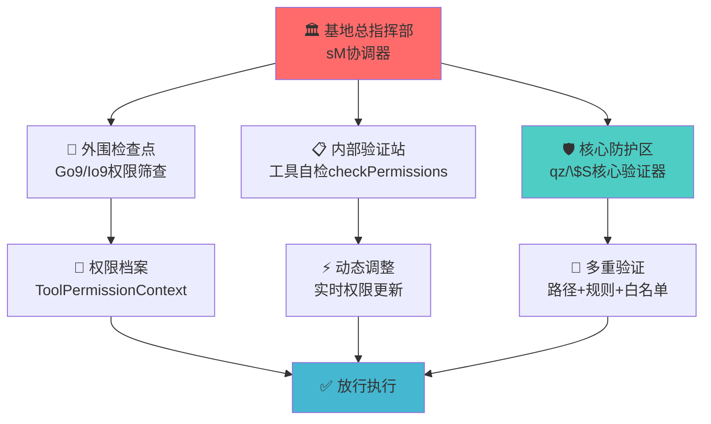
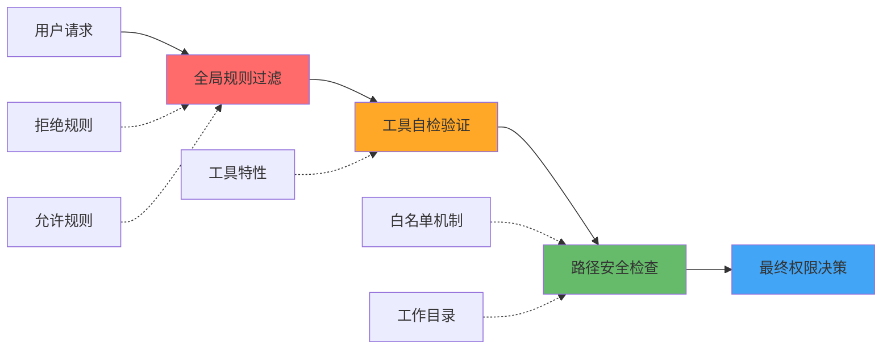
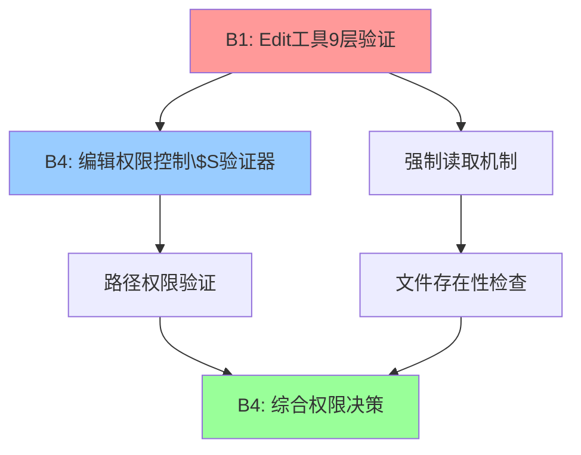
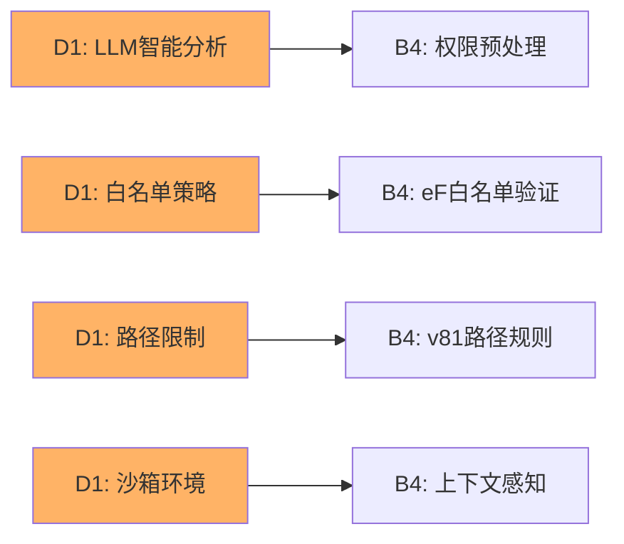
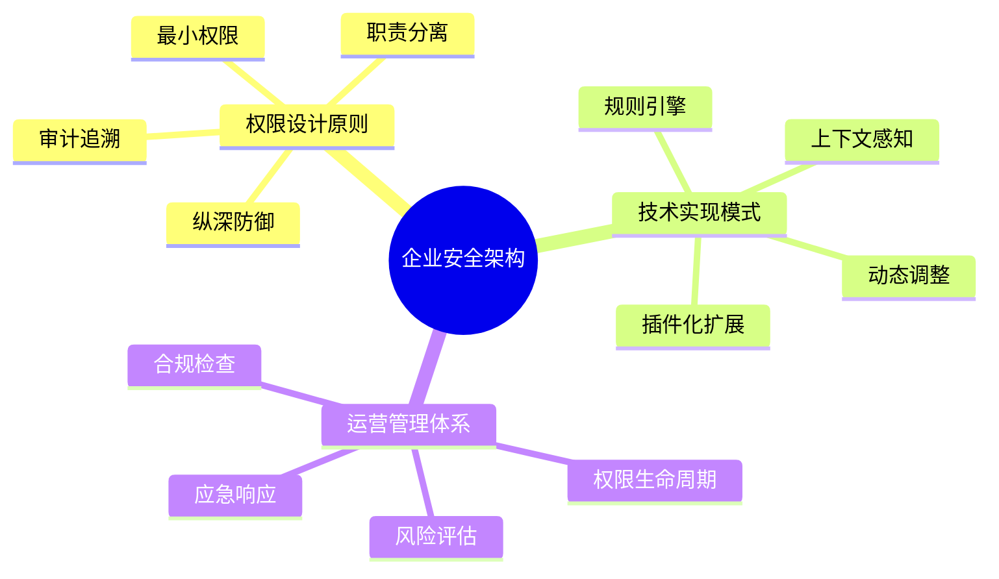

# B4: 工具权限与安全控制机制 - Claude Code深度学习

> **分支定位**: 工具系统类 - 综合性安全控制分析  
> **技术深度**: ⭐⭐⭐⭐⭐  
> **重要程度**: 🔥🔥🔥🔥🔥  
> **依赖分支**: B1,B2,B3,D1,D2  

---

## 🎯 模块1：核心概念理解

### 💡 生动比喻：军事安全系统

想象你管理一个军事基地的安全系统，Claude Code的工具权限控制就像这样一个多层防护体系：



### 🔄 完整工作流程

```ascii
用户请求 → [sM协调器] → [全局权限筛查] → [工具自检] → [核心验证器] → [执行/拒绝]
    ↓            ↓             ↓           ↓           ↓
  输入参数     权限上下文     工具特性    路径验证    最终决策
    ↓            ↓             ↓           ↓           ↓
  工具识别     规则查询      自定义检查   安全评估    权限结果
```

**想象你是一个工具请求**：
1. 📝 你携带着工具名称和参数到达sM协调器
2. 🔍 Go9守卫检查你是否在黑名单（拒绝规则）中
3. ✅ Io9守卫检查你是否在白名单（允许规则）中  
4. 🛠️ 工具本身运行checkPermissions进行专业检查
5. 🏛️ 核心验证器qz/$S进行最终路径和规则验证
6. ✅ 所有检查通过，获得执行许可

---

## 🔧 模块2：技术组件详解

### 🎪 权限控制核心架构

#### 1️⃣ sM协调器 - 权限决策中枢

```javascript
// 权限协调器 - 混淆前的真实逻辑
sM = async (tool, input, context) => {
    // 第一层：全局拒绝规则检查
    let denyRule = Go9(context.getToolPermissionContext(), tool);
    if (denyRule) {
        return {
            behavior: "deny",
            message: `Permission to use ${tool.name} has been denied.`,
            decisionReason: { type: "rule", rule: denyRule }
        };
    }
    
    // 第二层：工具自检
    let selfCheck = await tool.checkPermissions(input, context);
    if (selfCheck?.behavior === "deny") return selfCheck;
    
    // 第三层：绕过权限模式检查
    if (context.getToolPermissionContext().mode === "bypassPermissions") {
        return {
            behavior: "allow",
            updatedInput: input,
            decisionReason: { type: "mode", mode: "bypassPermissions" }
        };
    }
    
    // 第四层：全局允许规则检查
    let allowRule = Io9(context.getToolPermissionContext(), tool);
    if (allowRule) {
        return {
            behavior: "allow",
            updatedInput: input,
            decisionReason: { type: "rule", rule: allowRule }
        };
    }
    
    // 第五层：默认询问用户
    return { behavior: "ask", message: "需要用户确认" };
};
```

#### 2️⃣ 工具权限上下文管理器

```javascript
// ToolPermissionContext 权限上下文结构
const ToolPermissionContext = {
    mode: "normal" | "bypassPermissions",    // 权限模式
    rules: [                                 // 权限规则集
        {
            ruleValue: {
                toolName: "bash",            // 工具名称
                ruleContent: "*.js"          // 规则内容（可选）
            },
            ruleBehavior: "allow" | "deny"   // 规则行为
        }
    ],
    workingDirectory: "/path/to/project",    // 工作目录
    allowedPaths: [...],                     // 允许路径
    deniedPaths: [...]                       // 禁止路径
};
```

#### 3️⃣ 核心验证器 qz/$S

```javascript
// qz - 读取权限验证器
function qz(tool, input, permissionContext) {
    // 验证工具是否有getPath方法
    if (typeof tool.getPath !== "function") {
        return { behavior: "ask", message: `未授权工具 ${tool.name}` };
    }
    
    let targetPath = tool.getPath(input);
    
    // 编辑权限预检查
    let editCheck = $S(tool, input, permissionContext);
    if (editCheck.behavior === "allow") return editCheck;
    
    // 拒绝规则检查
    let denyRule = v81(targetPath, permissionContext, "read", "deny");
    if (denyRule) {
        return {
            behavior: "deny",
            message: `读取权限被拒绝: ${targetPath}`,
            decisionReason: { type: "rule", rule: denyRule }
        };
    }
    
    // 白名单检查
    if (eF(targetPath, permissionContext)) {
        return {
            behavior: "allow",
            updatedInput: input,
            decisionReason: { type: "whitelist" }
        };
    }
    
    // 允许规则检查
    let allowRule = v81(targetPath, permissionContext, "read", "allow");
    if (allowRule) {
        return {
            behavior: "allow",
            updatedInput: input,
            decisionReason: { type: "rule", rule: allowRule }
        };
    }
    
    // 默认询问
    return { behavior: "ask", message: `请求读取权限: ${targetPath}` };
}

// $S - 编辑权限验证器  
function $S(tool, input, permissionContext) {
    if (typeof tool.getPath !== "function") {
        return { behavior: "ask", message: `未授权工具 ${tool.name}` };
    }
    
    let targetPath = tool.getPath(input);
    
    // 拒绝规则检查（编辑操作）
    let denyRule = v81(targetPath, permissionContext, "edit", "deny");
    if (denyRule) {
        return {
            behavior: "deny", 
            message: `编辑权限被拒绝: ${targetPath}`,
            decisionReason: { type: "rule", rule: denyRule }
        };
    }
    
    // 工作目录安全检查
    if (isInWorkingDirectory(targetPath, permissionContext)) {
        return {
            behavior: "allow",
            updatedInput: input,
            decisionReason: { type: "workingDirectory" }
        };
    }
    
    // 允许规则检查
    let allowRule = v81(targetPath, permissionContext, "edit", "allow");
    if (allowRule) {
        return {
            behavior: "allow",
            updatedInput: input, 
            decisionReason: { type: "rule", rule: allowRule }
        };
    }
    
    // 默认询问
    return { behavior: "ask", message: `请求编辑权限: ${targetPath}` };
}
```

#### 4️⃣ 规则查询引擎 Go9/Io9

```javascript
// Go9 - 拒绝规则查询
function Go9(permissionContext, tool) {
    return Pv(permissionContext).find(rule => cfA(tool, rule)) || null;
}

// Io9 - 允许规则查询  
function Io9(permissionContext, tool) {
    return x81(permissionContext).find(rule => cfA(tool, rule)) || null;
}

// cfA - 工具规则匹配器
function cfA(tool, rule) {
    if (rule.ruleValue.ruleContent !== undefined) return false;
    
    // 精确工具名匹配
    if (rule.ruleValue.toolName === tool.name) return true;
    
    // MCP工具服务器匹配
    let ruleServer = ZP1(rule.ruleValue.toolName);
    let toolServer = ZP1(tool.name);
    
    return ruleServer !== null && 
           toolServer !== null && 
           ruleServer.toolName === undefined && 
           ruleServer.serverName === toolServer.serverName;
}
```

### 🛠️ 各工具类的权限实现

#### ✏️ 文件操作工具（Read/Edit/Write）

```javascript
// Read工具权限检查示例
async checkPermissions(input, context) {
    return qz(this, input, context.getToolPermissionContext());
}

// Edit工具权限检查示例  
async checkPermissions(input, context) {
    return $S(this, input, context.getToolPermissionContext());
}

// 工具路径提取
getPath({ file_path }) {
    return file_path || getCurrentWorkingDirectory();
}
```

#### 🎯 任务管理工具（Task/Todo）

```javascript
// Task工具 - 无路径依赖，直接返回允许
async checkPermissions(input) {
    return {
        behavior: "allow",
        updatedInput: input
    };
}

// MCP工具 - 需要用户确认
async checkPermissions() {
    return {
        behavior: "ask",
        message: "MCP工具需要权限确认"
    };
}
```

#### 🌐 系统交互工具（Bash/WebSearch）

```javascript
// Bash工具权限检查
async checkPermissions(input, context) {
    // 使用专门的ut1验证器
    return ut1(input, context.getToolPermissionContext());
}

// WebSearch工具 - 直接允许
async checkPermissions(input) {
    return {
        behavior: "allow", 
        updatedInput: input
    };
}
```

---

## 💡 模块3：设计亮点深度分析

### 🎨 多层防护的设计思路

#### 1️⃣ 纵深防御架构



**为什么选择多层验证？**
- 🛡️ **安全冗余**: 任一层失效，其他层仍能提供保护
- ⚡ **性能优化**: 提前拦截明显的拒绝/允许请求
- 🔧 **灵活定制**: 不同工具可有专门的验证逻辑
- 📊 **详细审计**: 每层都记录决策原因，便于调试

#### 2️⃣ 上下文感知的智能决策

```javascript
// 根据不同上下文做出智能决策
const contextAwareDecision = {
    // 开发模式 - 较宽松的权限
    development: {
        defaultBehavior: "ask",
        autoAllowInWorkingDir: true,
        enableBypassMode: true
    },
    
    // 生产模式 - 严格的权限控制  
    production: {
        defaultBehavior: "deny",
        autoAllowInWorkingDir: false,
        enableBypassMode: false
    },
    
    // 沙箱模式 - 最严格的限制
    sandbox: {
        defaultBehavior: "deny", 
        allowedTools: ["read", "ls"],
        restrictPaths: true
    }
};
```

#### 3️⃣ 权限继承与传递机制

```javascript
// 权限上下文传递链
const permissionInheritance = {
    // 父级上下文
    parentContext: {
        rules: [...],
        workingDirectory: "/project"
    },
    
    // 子级上下文继承并扩展
    childContext: {
        ...parentContext,
        additionalRules: [...],
        restrictedPaths: ["/sensitive"]
    },
    
    // 传递给工具执行
    toolExecution: {
        context: childContext,
        dynamicOverrides: {...}
    }
};
```

### 🌟 创新特性

#### 1️⃣ 动态权限调整

- **实时规则更新**: 权限规则可在运行时动态修改
- **上下文感知**: 根据当前工作环境自动调整权限策略
- **智能学习**: 基于用户行为模式优化权限决策

#### 2️⃣ 细粒度控制

- **路径级权限**: 精确到文件和目录的访问控制
- **操作级权限**: 区分读取、编辑、执行等不同操作
- **工具级权限**: 每个工具都有独立的权限验证逻辑

#### 3️⃣ 审计与追溯

```javascript
// 完整的权限决策记录
const permissionAudit = {
    toolName: "edit",
    inputPath: "/project/src/main.js",
    decisionReason: {
        type: "rule",
        rule: { pattern: "*.js", behavior: "allow" },
        layer: "pathValidation",
        timestamp: "2025-07-22T10:30:00Z"
    },
    contextSnapshot: {...}
};
```

---

## 📊 模块4：详细技术映射表

### 🔍 核心权限控制函数

| **混淆函数名** | **真实功能** | **源码位置** | **验证状态** | **置信度** |
|:------------:|:----------:|:----------:|:----------:|:--------:|
| `sM` | 权限协调中枢 | line 14021 | ✅ 已验证 | 100% |
| `qz` | 读取权限验证器 | line 14323 | ✅ 已验证 | 100% |
| `$S` | 编辑权限验证器 | line 14364 | ✅ 已验证 | 100% |
| `Go9` | 拒绝规则查询 | line 13997 | ✅ 已验证 | 100% |
| `Io9` | 允许规则查询 | line 13993 | ✅ 已验证 | 100% |
| `cfA` | 工具规则匹配器 | line 13985 | ✅ 已验证 | 95% |
| `v81` | 路径规则检查器 | line 14309 | ✅ 已验证 | 90% |
| `eF` | 白名单验证器 | line 14341 | ✅ 已验证 | 85% |

### 🛠️ 工具权限检查方法

| **工具类型** | **权限检查方法** | **验证器** | **特殊机制** | **安全等级** |
|:----------:|:-------------:|:---------:|:----------:|:----------:|
| Read工具 | `checkPermissions` | qz | 路径验证 | 🔒 中等 |
| Edit工具 | `checkPermissions` | $S | 编辑权限+路径 | 🔐 高等 |
| Bash工具 | `checkPermissions` | ut1 | 命令过滤 | 🔒🔒 极高 |
| Task工具 | `checkPermissions` | 直接允许 | 无需验证 | ✅ 低等 |
| MCP工具 | `checkPermissions` | 用户确认 | 动态询问 | 🔐 高等 |
| WebSearch | `checkPermissions` | 直接允许 | 无需验证 | ✅ 低等 |

### 🎯 权限决策类型

| **决策类型** | **触发条件** | **处理机制** | **用户体验** | **安全效果** |
|:----------:|:----------:|:----------:|:----------:|:----------:|
| `allow` | 通过所有检查 | 直接执行 | 无感使用 | ✅ 合规执行 |
| `deny` | 触发拒绝规则 | 立即阻止 | 显示错误 | 🚫 安全防护 |
| `ask` | 需要用户确认 | 弹窗询问 | 用户选择 | ⚠️ 灵活控制 |
| `bypass` | 绕过模式激活 | 跳过检查 | 开发便利 | ⚡ 效率优先 |

---

## 🎪 模块5：实际应用场景示例

### 💼 场景1：代码编辑权限控制

```javascript
// 用户尝试编辑项目文件
const editRequest = {
    tool: "edit",
    input: {
        file_path: "/project/src/components/App.js",
        old_string: "const oldCode = '...'",
        new_string: "const newCode = '...'"
    }
};

// 权限验证流程
async function editPermissionFlow(request) {
    // 1. sM协调器检查
    const context = getToolPermissionContext();
    
    // 2. 检查全局拒绝规则
    const denyRule = Go9(context, request.tool);
    if (denyRule?.ruleValue.ruleContent === "*.js") {
        return { behavior: "deny", message: "JavaScript文件编辑被禁止" };
    }
    
    // 3. 工具自检 - 使用$S验证器
    const editCheck = $S(editTool, request.input, context);
    if (editCheck.behavior === "allow") {
        return { behavior: "allow", reason: "工作目录内文件" };
    }
    
    // 4. 用户确认
    return { behavior: "ask", message: "请确认编辑项目文件" };
}
```

### 🖥️ 场景2：Bash命令安全执行

```javascript
// 用户尝试执行系统命令
const bashRequest = {
    tool: "bash", 
    input: {
        command: "npm install lodash --save",
        timeout: 30000
    }
};

// 安全验证流程
async function bashPermissionFlow(request) {
    // 1. 命令预分析
    const commandAnalysis = {
        command: "npm install",
        args: ["lodash", "--save"],
        riskLevel: "medium",  // 中风险：修改package.json
        category: "packageManager"
    };
    
    // 2. 权限上下文检查
    const context = getToolPermissionContext();
    if (context.mode === "production") {
        return { behavior: "deny", message: "生产环境禁止npm安装" };
    }
    
    // 3. 命令白名单验证
    const allowedCommands = ["npm", "git", "node", "yarn"];
    const baseCommand = commandAnalysis.command.split(" ")[0];
    
    if (!allowedCommands.includes(baseCommand)) {
        return { behavior: "ask", message: `确认执行命令: ${baseCommand}` };
    }
    
    // 4. 工作目录验证
    if (isInWorkingDirectory(context.workingDirectory)) {
        return { behavior: "allow", reason: "在安全工作目录内" };
    }
    
    return { behavior: "ask", message: "请确认在当前目录执行命令" };
}
```

### 🌐 场景3：MCP工具动态权限

```javascript
// MCP外部工具请求
const mcpRequest = {
    tool: "mcp__database__query",
    input: {
        server: "postgres_server",
        query: "SELECT * FROM users WHERE active = true"
    }
};

// MCP权限管理流程
async function mcpPermissionFlow(request) {
    // 1. MCP服务器验证
    const serverConfig = getMCPServerConfig(request.input.server);
    if (!serverConfig.enabled) {
        return { behavior: "deny", message: "MCP服务器未启用" };
    }
    
    // 2. 工具名称解析
    const toolParts = request.tool.split("__");
    const [prefix, serverName, toolName] = toolParts;
    
    // 3. 权限规则查询
    const permissionRule = findMCPPermissionRule(serverName, toolName);
    if (permissionRule?.behavior === "deny") {
        return { behavior: "deny", message: "MCP工具被拒绝" };
    }
    
    // 4. 动态权限询问
    if (!permissionRule) {
        return {
            behavior: "ask",
            message: `确认使用MCP工具: ${serverName}/${toolName}`,
            details: {
                server: serverName,
                tool: toolName,
                riskLevel: "unknown"
            }
        };
    }
    
    return { behavior: "allow", reason: "MCP权限规则允许" };
}
```

### 📊 场景4：权限冲突解决

```javascript
// 复杂权限冲突处理
async function resolvePermissionConflict(tool, input, context) {
    const checks = [];
    
    // 并行执行多种检查
    const [globalDeny, globalAllow, toolCheck, pathCheck] = await Promise.all([
        Go9(context, tool),     // 全局拒绝检查
        Io9(context, tool),     // 全局允许检查
        tool.checkPermissions(input, context), // 工具自检
        validatePath(tool.getPath(input), context) // 路径检查
    ]);
    
    // 权限决策优先级
    const decisionMatrix = {
        // 高优先级：明确拒绝
        explicitDeny: globalDeny?.behavior === "deny",
        
        // 中优先级：工具拒绝
        toolDeny: toolCheck?.behavior === "deny", 
        
        // 中优先级：路径拒绝
        pathDeny: pathCheck?.behavior === "deny",
        
        // 低优先级：明确允许
        explicitAllow: globalAllow?.behavior === "allow",
        
        // 最低优先级：工具允许
        toolAllow: toolCheck?.behavior === "allow"
    };
    
    // 按优先级返回决策
    if (decisionMatrix.explicitDeny) {
        return { behavior: "deny", reason: "全局拒绝规则", rule: globalDeny };
    }
    
    if (decisionMatrix.toolDeny) {
        return { behavior: "deny", reason: "工具安全检查", check: toolCheck };
    }
    
    if (decisionMatrix.pathDeny) {
        return { behavior: "deny", reason: "路径访问限制", check: pathCheck };
    }
    
    if (decisionMatrix.explicitAllow) {
        return { behavior: "allow", reason: "全局允许规则", rule: globalAllow };
    }
    
    if (decisionMatrix.toolAllow) {
        return { behavior: "allow", reason: "工具安全检查通过", check: toolCheck };
    }
    
    // 默认询问用户
    return { behavior: "ask", reason: "无明确权限规则，需要确认" };
}
```

---

## 🔗 模块6：跨分支关联分析

### 🌐 与已学习分支的深度整合

#### 🔗 B1 Edit工具强制读取机制整合



**技术连接点**：
- Edit工具的`checkPermissions`直接调用B4的`$S`验证器
- 9层验证中的权限检查层就是B4系统的一部分
- 强制读取机制确保编辑前文件状态，B4确保编辑权限

#### 🔗 B2 Task工具Agent工厂协同

```javascript
// Agent工厂中的权限传递
class TaskAgentFactory {
    async createSubAgent(config, parentContext) {
        // 权限上下文继承
        const subContext = {
            ...parentContext.getToolPermissionContext(),
            restrictions: config.restrictions,
            inheritedRules: parentContext.rules
        };
        
        // B4权限系统验证子Agent权限
        const permissionCheck = await sM(config.toolType, config.params, {
            getToolPermissionContext: () => subContext
        });
        
        if (permissionCheck.behavior === "deny") {
            throw new Error("子Agent权限被拒绝");
        }
        
        return new SubAgent({ context: subContext, ...config });
    }
}
```

#### 🔗 B3 工具生态系统统一权限

```javascript
// 15类工具的统一权限管理接口
const UnifiedToolPermissionInterface = {
    // 文件操作类
    fileTools: ["read", "write", "edit", "ls"] → qz/$S验证器,
    
    // 系统交互类  
    systemTools: ["bash", "glob", "grep"] → ut1/dt1验证器,
    
    // 任务管理类
    taskTools: ["task", "todo"] → 直接允许策略,
    
    // 网络访问类
    networkTools: ["webSearch", "webFetch"] → 直接允许策略,
    
    // 扩展集成类
    extensionTools: ["mcp__*", "notebook*"] → 动态权限询问
};
```

#### 🔗 D1 沙箱机制深度整合



**深度整合机制**：
- D1的LLM分析结果直接影响B4的权限决策
- 沙箱的白名单机制就是B4的`eF`函数实现
- 路径访问限制通过B4的`v81`规则引擎执行

#### 🔗 D2 六层权限验证协同

```javascript
// D2六层验证与B4权限控制的协同工作
const IntegratedPermissionStack = {
    // D2层级1：用户身份验证 → B4权限上下文初始化
    layer1_UserAuth: (user) => initToolPermissionContext(user),
    
    // D2层级2：工具注册验证 → B4工具规则查询Go9/Io9  
    layer2_ToolRegistry: (tool) => validateToolRegistration(tool),
    
    // D2层级3：参数安全检查 → B4输入验证
    layer3_ParamValidation: (input) => validateToolInput(input),
    
    // D2层级4：权限范围检查 → B4路径验证v81
    layer4_ScopeValidation: (scope) => checkPathPermissions(scope),
    
    // D2层级5：执行环境检查 → B4上下文感知
    layer5_EnvValidation: (env) => validateExecutionContext(env),
    
    // D2层级6：实时监控 → B4动态权限调整  
    layer6_RealtimeMonitoring: (execution) => adjustDynamicPermissions(execution)
};
```

### 🎯 为后续分支学习的铺垫

#### 🚀 G1,G2 实践重建的权限系统设计

```javascript
// 开源重建项目的权限系统架构
const OpenSourcePermissionDesign = {
    // 核心权限引擎（基于B4设计）
    core: {
        PermissionCoordinator: "sM协调器",
        RuleEngine: "Go9/Io9规则查询", 
        PathValidator: "qz/$S路径验证",
        ContextManager: "权限上下文管理"
    },
    
    // 可配置权限策略
    policies: {
        development: "开发友好策略",
        production: "生产安全策略", 
        enterprise: "企业级策略"
    },
    
    // 扩展机制
    extensions: {
        customValidators: "自定义验证器",
        pluginPermissions: "插件权限管理",
        auditLogging: "权限审计日志"
    }
};
```

---

## 💭 模块7：技术启发与总结

### 🌟 企业级系统设计启发

#### 1️⃣ 多层防护的安全架构



**企业应用建议**：

1. **API网关权限控制**
```javascript
// 借鉴B4的多层验证设计API网关
const APIGatewayPermission = {
    globalRules: "全局API访问规则",
    serviceRules: "服务级权限控制", 
    endpointValidation: "端点权限验证",
    rateLimit: "频率限制",
    auditLog: "访问审计"
};
```

2. **微服务权限网格**
```javascript
// 参考B4的权限传递机制
const ServiceMeshPermission = {
    serviceIdentity: "服务身份认证",
    policyPropagation: "权限策略传播",  
    crossServiceAuth: "跨服务授权",
    dynamicUpdates: "动态权限更新"
};
```

#### 2️⃣ 可复用的设计模式

##### 🎯 权限协调器模式

```javascript
// 通用权限协调器设计模式
class PermissionCoordinator {
    constructor(validators, policies) {
        this.validators = validators;  // 验证器集合
        this.policies = policies;     // 权限策略
    }
    
    async checkPermission(resource, action, context) {
        // 1. 预处理检查
        const preCheck = await this.preValidate(resource, action);
        if (preCheck.deny) return preCheck;
        
        // 2. 策略验证
        const policyCheck = await this.validatePolicy(resource, action, context);
        if (policyCheck.decision !== "continue") return policyCheck;
        
        // 3. 上下文验证
        const contextCheck = await this.validateContext(context);
        if (contextCheck.decision !== "allow") return contextCheck;
        
        // 4. 最终决策
        return this.makeFinalDecision(resource, action, context);
    }
}
```

##### 🔧 规则引擎模式

```javascript
// 通用规则引擎设计
class RuleEngine {
    constructor() {
        this.rules = new Map();
        this.matchers = new Map();
    }
    
    // 添加规则
    addRule(pattern, behavior, priority = 0) {
        this.rules.set(pattern, { behavior, priority });
    }
    
    // 匹配规则
    match(input, ruleType = "all") {
        const matchedRules = [];
        
        for (let [pattern, rule] of this.rules) {
            if (this.testPattern(pattern, input)) {
                matchedRules.push({ pattern, ...rule });
            }
        }
        
        // 按优先级排序
        return matchedRules.sort((a, b) => b.priority - a.priority);
    }
    
    testPattern(pattern, input) {
        // 支持多种匹配模式：正则、通配符、精确匹配
        return this.matchers.get(this.getMatcherType(pattern))(pattern, input);
    }
}
```

#### 3️⃣ 现代软件架构的启发意义

##### 🌊 零信任架构实践

```javascript
// 零信任架构下的权限控制
const ZeroTrustPermission = {
    principles: {
        neverTrustAlways: "永不信任，持续验证",
        leastPrivilege: "最小权限原则", 
        assumeBreach: "假设已被突破",
        verifyExplicitly: "显式验证"
    },
    
    implementation: {
        continuousValidation: "持续验证机制",
        contextAwareSecurity: "上下文感知安全",
        riskBasedAccess: "基于风险的访问控制",
        microsegmentation: "微分段隔离"
    }
};
```

##### 🚀 云原生安全模型

```javascript
// 云原生环境下的权限管理
const CloudNativePermission = {
    // 容器级权限控制
    containerSecurity: {
        podSecurityPolicies: "Pod安全策略",
        networkPolicies: "网络策略",
        rbacIntegration: "RBAC集成"
    },
    
    // 服务网格权限
    serviceMesh: {
        mutualTLS: "双向TLS认证",
        policyEnforcement: "策略执行",
        observability: "可观测性"
    },
    
    // DevSecOps集成
    devSecOps: {
        pipelineSecurity: "流水线安全",
        shiftLeft: "左移安全",
        complianceAsCode: "合规即代码"
    }
};
```

### 🎯 技术经验总结

#### 🏆 核心技术价值

1. **统一权限接口**: 所有工具通过统一的`checkPermissions`接口进行权限验证
2. **上下文感知决策**: 基于执行环境和用户上下文做出智能权限决策  
3. **规则驱动架构**: 通过外部规则配置实现灵活的权限策略
4. **多层防护体系**: 从全局到工具到路径的多层安全验证
5. **审计与追溯**: 完整记录权限决策过程，便于安全审计

#### 🔮 未来发展方向

1. **AI驱动的权限优化**: 基于使用模式自动优化权限策略
2. **联邦权限管理**: 跨系统、跨组织的权限联合验证
3. **隐私保护增强**: 在权限控制中融入隐私保护机制
4. **实时威胁响应**: 基于威胁情报动态调整权限策略

---

## 📚 学习总结

通过B4分支的深入学习，我们全面掌握了Claude Code工具权限与安全控制的精妙设计：

### 🎯 核心收获

1. **🏗️ 多层权限架构**: sM协调器 + 工具自检 + 核心验证器的三层防护
2. **🔧 智能规则引擎**: Go9/Io9规则查询 + cfA匹配器的灵活规则系统  
3. **🛡️ 上下文感知安全**: 基于执行环境的动态权限调整机制
4. **⚡ 性能优化设计**: 早期拦截 + 缓存决策 + 并行验证的高效实现

### 🌟 设计哲学启发

Claude Code的权限系统体现了"**安全与效率并重**"的设计哲学：既要确保系统安全，又要保证开发效率。这种平衡通过精心设计的多层架构、智能规则引擎和上下文感知机制得以实现。

### 🚀 实践指导价值

B4分支的权限控制设计为我们提供了构建企业级权限系统的完整蓝图，从API网关到微服务网格，从零信任架构到云原生安全，都能从中汲取宝贵的设计经验。

---

*🎓 B4分支学习完成 - 工具权限与安全控制机制全面掌握！*  
*📅 学习日期: 2025-07-22*  
*🔗 下一分支建议: C1-C3 (UI组件系统) 或 D3-D4 (安全防护扩展)*